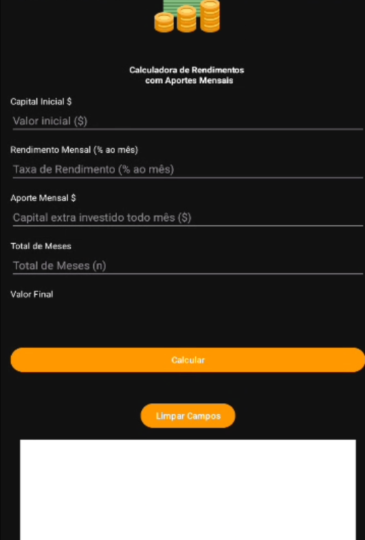

# kotlin_monthly-deposit-calculator
App to calculate final balance based on interest rate, term, and initial amount. Supports regular deposits and plots a growth chart of the accumulated value.
It provides two calculation modes: with and without an **initial deposit**, including interest rates, and shows results both numerically and through interactive charts.

---

## Features

-  **Investment growth chart** using [MPAndroidChart](https://github.com/PhilJay/MPAndroidChart)
    - Compare progress **with interest** vs **without interest**.
-  **Financial formulas built-in**:
    - Future value of monthly deposits (annuity).
    - Future value with an initial capital + recurring contributions.
-  **Equation viewer** — displays the exact formula used for calculations.
-  **Lottie animations** for a more engaging user experience.
-  **Clear fields button** to quickly reset inputs and start a new simulation.
-  Results formatted in **Brazilian Real (R$)** with proper number formatting.

---

## Screens

- **Main screen**: choose between monthly deposits or deposits with initial capital.

- **Monthly deposits**: calculate missing values (n, j, p, or Sn) given three known variables.

- **With initial deposit**: calculate and display growth over time with a chart.

---

##  Tech Stack

- **Kotlin**
- **AndroidX / Jetpack** (AppCompat, ConstraintLayout, etc.)
- **MPAndroidChart** (line charts with filled areas)
- **Lottie** (vector animations)
- **Material Components**

---

##  Project Structure

- `MainActivity` → navigation between the two calculators.
- `ScreenMonthlyDepositActivity` → simulator for monthly deposits (without initial capital).
- `ScreenWithInitialDepositActivity` → simulator for deposits with initial capital, displays chart.
- `ChartHelper` → encapsulates MPAndroidChart setup and styling.

---
